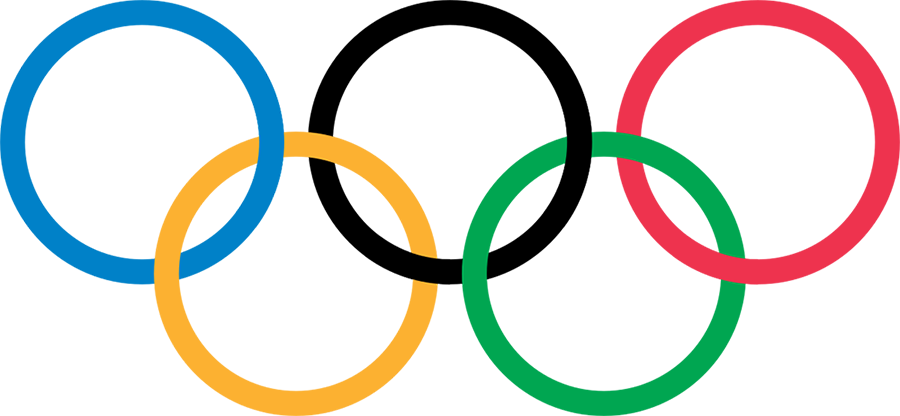
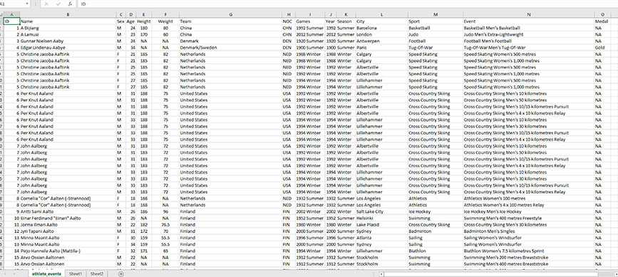
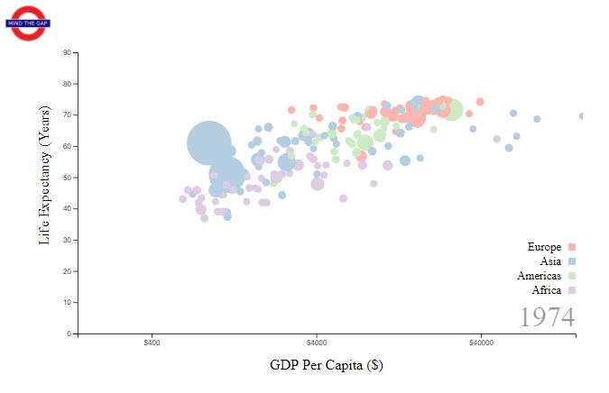
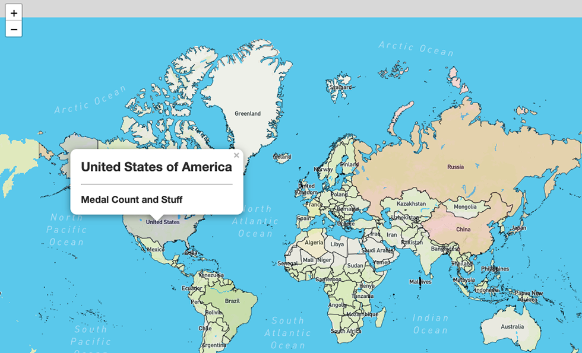

# A Look At The Olympics (1896-2016)

## Project Contributors

- Kristy Anderson
- Tony Cipolle
- Nicole Cook
- Debby Pulido

# Project Proposal

## Data Sources

- **Main Data Source**: [120 Years of Olympic History](https://www.kaggle.com/heesoo37/120-years-of-olympic-history-athletes-and-results/home). This is a historical dataset on the modern Olympic Games, including all the Games from Athens 1896 to Rio 2016. Also includes a NOC (National Olympic Committee) dataset that will allow us to map each athlete to a country.
- **Lat/Long Coordinates by Country**: [Latitude and Longitude for Every Country and State](https://www.kaggle.com/paultimothymooney/latitude-and-longitude-for-every-country-and-state). This dataset will be used to get the lat/long coordinates of each country/city for map overlays.
- **Example of Data**:  
  

## Proposed Analysis

### Considerations

- Analysis to be split out by Winter/Summer games.
- Athletes to be assigned a country based on their NOC code.

### Data Cleaning

- Data should be cleaned for duplicates as athletes can compete in more than one event and across multiple years.
- Data should be cleaned for any null values before performing analysis on specific data points.

### Analysis to be conducted - Work in Progress

- Is there a difference in the gender make up of Olympic athletes over time?
- Is there a difference in the age make up of Olympic athletes over time?
- What is the break out of gold/total medals won by country?
- Which countries have the tallest/shortest athletes? (for fun!)
- Have the number of official sports included in the Olympics changed over time?

### Proposed Visualizations (with examples) - Work in Progress

- Charts should have a toggle for summer/winter olympics
- Bubble chart over time - Gender by country over time  
  
- Map overlay of countries with medal counts 
  
- Filterable table of the data
- Link to proposed website mockup: [PDF Mockup](proposal/example_website_layout.pdf)

## Project Specific Requirements

1.  Your website must include:
    - A Python Flask-powered API
    - HTML/CSS
    - JavaScript
    - At least one database (SQL, MongoDB, SQLite, etc.)
2.  Your website can feature either:
    - One complex, dynamic and interactive custom d3.js visualization
    - Multiple leaflet, plotly or other d3-wrapper-type visualizations that update from the same data source
3.  Your website's dataset can come from:
    - A single source or multiple sources as long as it has at least 100 records in it's final form
    - Web scraping, API calls, or csv's that have ben ETL'd into your database, and live API calls
4.  Your website must include at least one JavaScript library we did not cover in class. See below for suggestions:
    - [The best JavaScript libraries](https://getflywheel.com/layout/best-javascript-libraries-frameworks-2020/#libraries)
    - [11 Javascript Data Visualization Libraries](https://blog.bitsrc.io/11-javascript-charts-and-data-visualization-libraries-for-2018-f01a283a5727)
5.  Your website must have interactivity:
    - The user must be able to dynamically change some aspect of the page
    - You can accomplish this with inputs, buttons or menus
6.  Your website should allow for three distinct views of your data:
    - If you've built one dynamic d3.js visualization you might have aspects of the visualization change based on user input, allowing for at least three different views.
    - If you've built a dashboard of multiple visualizations, have at least three different visualizations that can be plots, charts, graphs or maps. You still have to work in some interactivity, though.

## For Project Completion

1.  List item The original project proposal must be included in the repository readme file.
2.  A requirements.txt file must be included at the root level of the repository. This means that you must create a fresh virtual environment for development and only install the python modules necessary for your project to work.
3.  Full instructions for someone to recreate your website locally must be included in the repository. This means you may need to include an ERD, a schema file, and any source files necessary for recreating your database locally.
4.  You must include instructions for usage of your API. This can be as simple as an API “homepage” with links to your endpoints, however if you’ve built out a RESTful API that gives access to your data include instructions for structuring an endpoint URL.
5.  Your repository must be well organized. Your code must be well documented. Your network graph must show full group participation and collaboration.
6.  Optionally, you can deploy your website. We recommend Heroku, as it has a free tier that is sufficient for hosting your projects, and it is fairly well documented. Though, since it’s optional, it’s entirely up to you. We are also happy to assist.
7.  All group members must contribute to the presentation for credit. It is advised that you use your website as your presentation visual, as opposed to producing a slideshow or PowerPoint. As always, be prepared to show your code. Presentations will be interrupted at 10 minutes.
